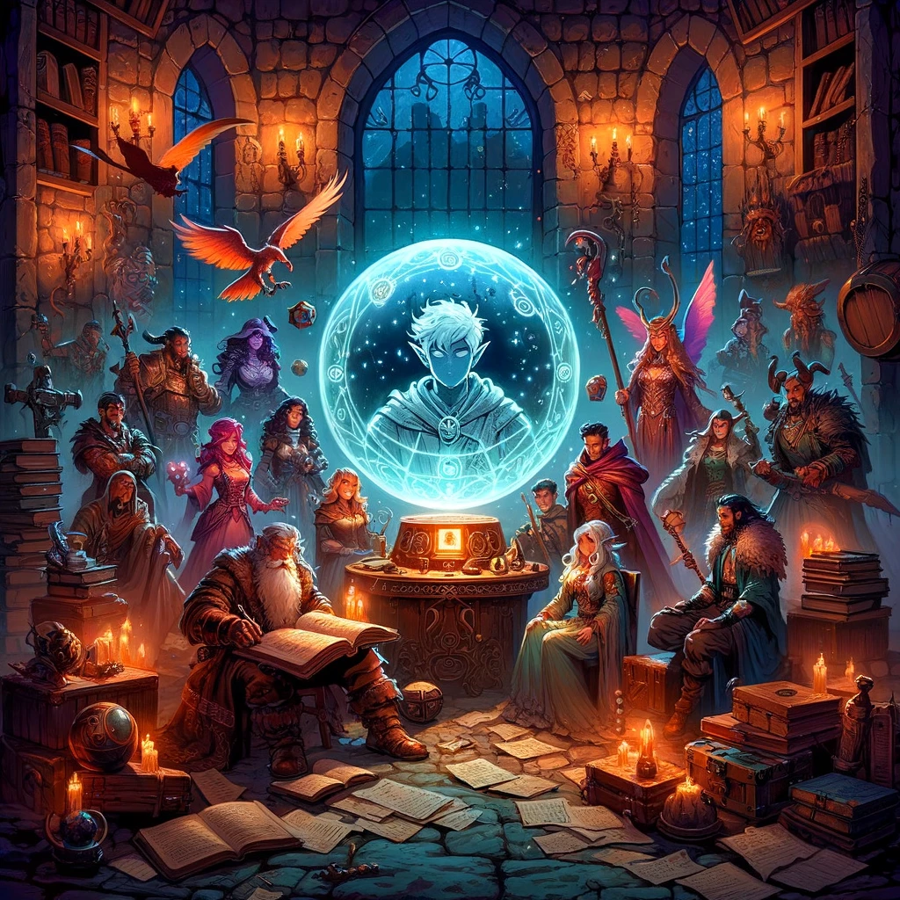

# D&D Character Portrait Generator

# Overview

This project is a Dungeons & Dragons (D&D) character portrait generator built using Python and Streamlit. It allows users to create custom D&D characters by selecting various attributes and features, and then generates a corresponding character portrait using OpenAI's DALL-E model. In this way you can concentrate yourself on the character and do not need to fight with finding the right wording for a "perfect prompt".

# Features

Character Customization: Users can select from a range of attributes including race, subrace, sex, age, physique, skin color, hair style, and more.
Image Generation: Based on the selected attributes, the application generates a character portrait using DALL-E.
Image Timeline: The application maintains a history of generated portraits, displayed in a chronological timeline.
Interactive UI: Built with Streamlit, the application provides an easy-to-use and interactive user interface.

# Installation

To run this project, you need Python installed on your system. You also need to install the required libraries:

"pip install streamlit openai pillow requests"

# Usage

# Start the App:

Run the app using Streamlit:

streamlit run app.py

# Navigate the App:

The app has different tabs for character creation and viewing the image timeline.

# Create a Character:

Select character attributes in the provided fields and generate a portrait using the "Generate Character Image" button.

# View Generated Portraits:

Switch to the "Image Timeline" tab to view all previously generated portraits.

# Configuration

OpenAI API Key: Store your OpenAI API key in a secrets.json file for security. The format should be:

{
"openai_api_key": "your_api_key_here"
}

# Image Saving

Generated images are saved in the history folder. This folder is ignored in .gitignore to prevent uploading to version control.

# License

This project uses the GNU General Public License v3.0.
